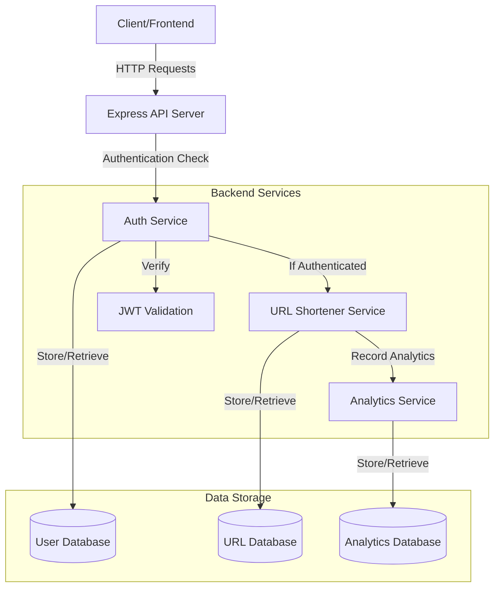
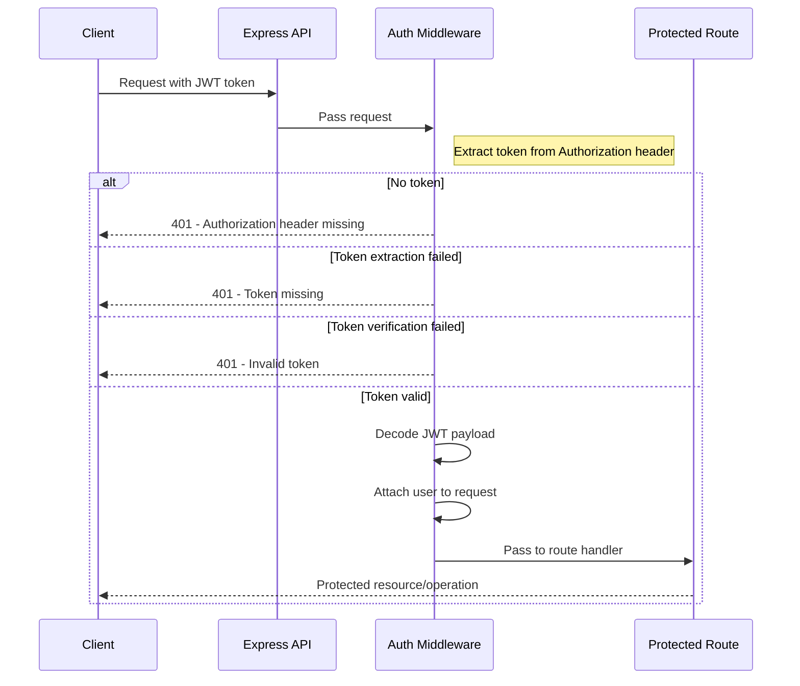
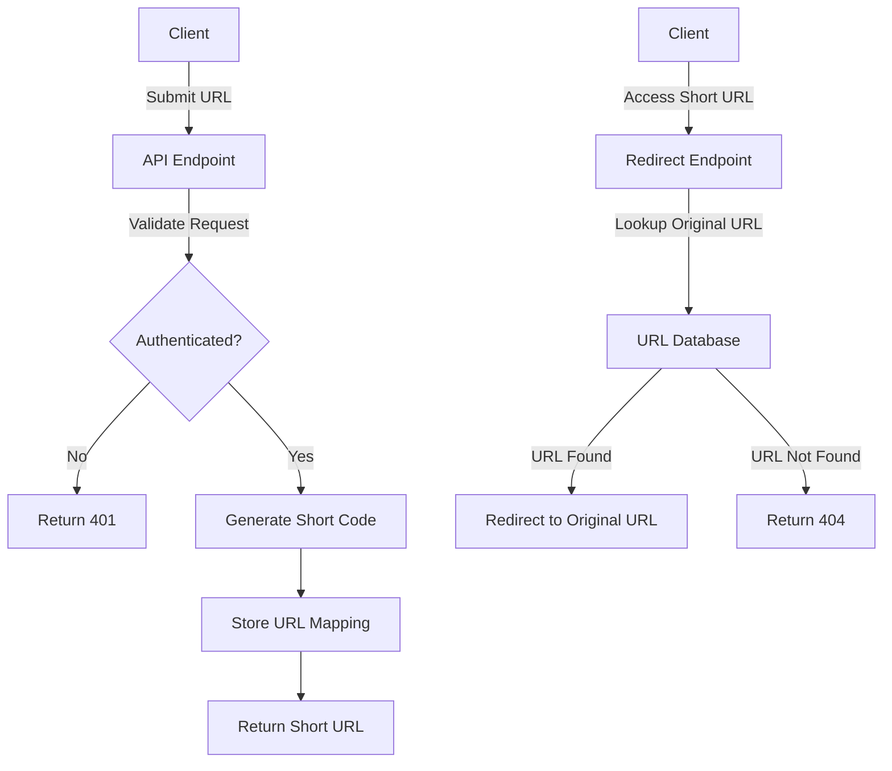
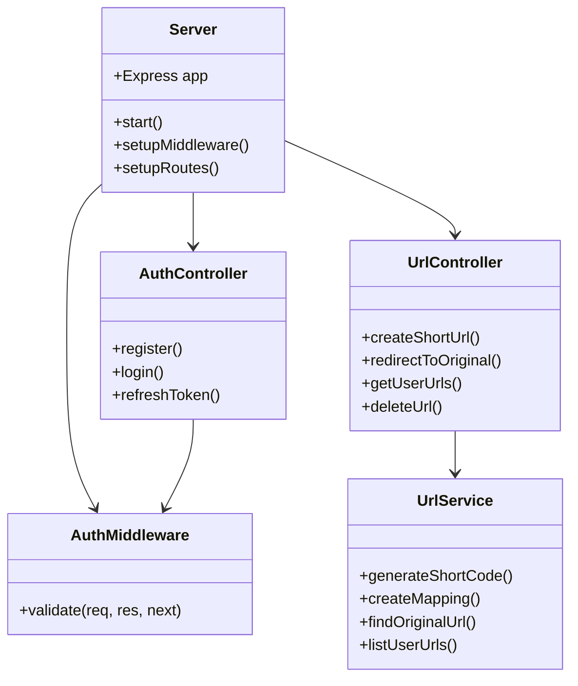
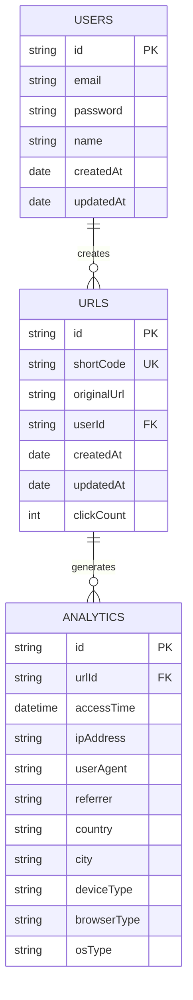

# URL Shortener API - Project Diagram

This document provides visual representations of the URL Shortener API architecture and workflows.

## System Architecture

## Authentication Flow

## URL Shortening Process

## Component Structure

## Database Schema

